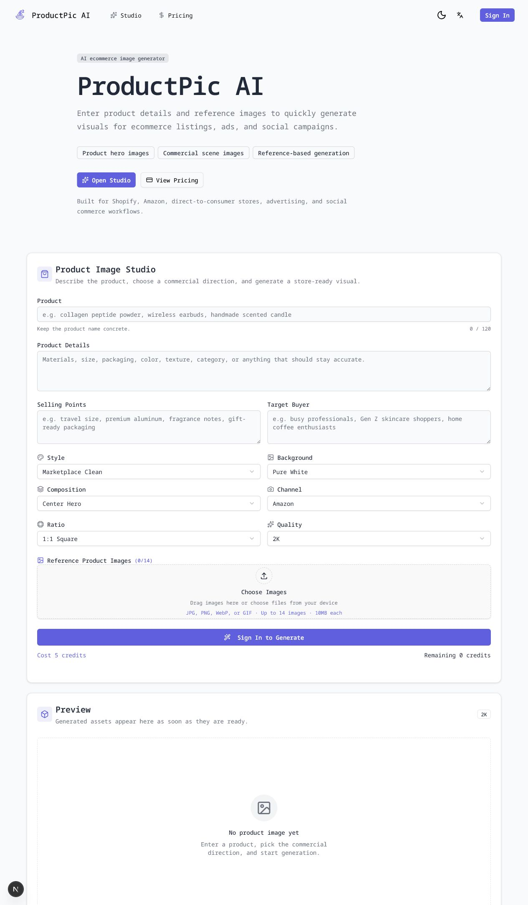
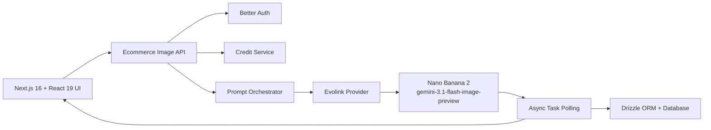

# ProductPic AI

> AI 电商商品图生成工作台 / AI ecommerce product image studio

[中文](#中文介绍) · [English](#english) · [在线架构](#技术架构--architecture)



## 中文介绍

ProductPic AI 是一个面向电商卖家、品牌团队和内容运营人员的 AI 商品图生成 SaaS。用户只需描述商品、卖点和目标人群，再选择视觉风格、背景、构图、投放渠道、画面比例及清晰度，即可生成适用于商品详情页、平台主图、广告和社交媒体的专业视觉素材。

产品不是把用户输入直接交给模型，而是通过内置的商业摄影提示词系统，将商品信息与风格、背景、构图和渠道规范组合成结构化提示词，并附加商品真实性、文字与品牌安全等约束，使结果更稳定、更接近可直接使用的电商素材。

### 核心功能

- **商品信息输入**：支持商品名称、材质与包装细节、核心卖点、目标用户。
- **参考图生成**：最多上传 14 张商品参考图，帮助模型保持外观和包装特征。
- **6 种商业风格**：平台白底、奢华编辑、DTC 极简、社媒广告、自然有机、科技高级。
- **8 种背景方向**：纯白、柔和渐变、石材台面、居家生活、植物、都市霓虹、节日营销、户外阳光。
- **5 种构图方式**：居中主图、四分之三视角、俯拍平铺、细节特写、套装场景。
- **渠道适配**：针对 Amazon、Shopify、Instagram 和小红书提供专用提示词。
- **多规格输出**：支持 `1:1`、`4:5`、`3:4`、`16:9`，以及 `1K`、`2K`、`4K` 清晰度。
- **SaaS 完整链路**：用户认证、积分计费、异步任务轮询、失败退款、结果预览与下载。
- **中英文界面**：内置 English / 简体中文国际化资源。

### 使用的 AI 模型

当前图像生成能力由 **Nano Banana 2** 提供，对应 API 模型标识：

```text
gemini-3.1-flash-image-preview
```

项目通过 [Evolink API](https://docs.evolink.ai/) 接入模型，使用异步任务机制提交生成请求并查询结果。当前启用高思考等级，支持文本生图、参考图驱动生成、多画幅和最高 4K 输出。模型访问封装在独立 Provider 中，业务层不直接依赖第三方接口，后续可以继续接入其他图像模型。

### 产品工作流

1. 输入商品名称、细节、卖点和目标消费者。
2. 上传已有商品图作为视觉参考，或直接使用文本生成。
3. 选择风格、背景、构图、渠道、比例和清晰度。
4. 服务端组合商业摄影 Prompt，并加入真实性与品牌安全约束。
5. 检查登录状态和积分，创建异步 AI 任务。
6. 前端轮询任务进度，成功后展示并下载成品；失败任务自动退回积分。

## English

ProductPic AI is an AI ecommerce image studio for merchants, brand teams, and content operators. Users describe a product and its selling points, choose a visual direction, and generate polished assets for product detail pages, marketplace listings, advertising, and social commerce.

Instead of forwarding raw user input to the model, ProductPic AI composes a structured commercial photography prompt from product details, style, background, composition, and channel presets. It also adds safeguards for realistic geometry, readable packaging, clean branding, and marketplace-ready cropping.

### Key Features

- **Product brief** with product details, selling points, and target audience.
- **Reference-guided generation** with up to 14 product images.
- **6 commercial styles**, including marketplace clean, luxury editorial, DTC minimal, social ad, natural organic, and tech premium.
- **8 background directions**, from pure white studios to lifestyle, botanical, seasonal, and outdoor scenes.
- **5 compositions** for hero, three-quarter, flat lay, macro detail, and product bundle imagery.
- **Channel-aware prompts** for Amazon, Shopify, Instagram, and Xiaohongshu.
- **Flexible output** in `1:1`, `4:5`, `3:4`, and `16:9`, with `1K`, `2K`, and `4K` quality options.
- **Production SaaS flow** with authentication, credit billing, asynchronous task polling, automatic failure refunds, preview, and download.
- **Bilingual UI** with English and Simplified Chinese resources.

### AI Model

The current image pipeline uses **Nano Banana 2**, exposed through the following API model identifier:

```text
gemini-3.1-flash-image-preview
```

The model is integrated through the [Evolink API](https://docs.evolink.ai/). Requests run as asynchronous tasks and support text-to-image, reference-guided generation, multiple aspect ratios, and output up to 4K. The integration lives behind a dedicated provider adapter so additional image providers can be added without coupling them to the product workflow.

### User Flow

1. Enter the product brief, key benefits, and target customer.
2. Optionally upload existing product images as visual references.
3. Select a style, background, composition, channel, ratio, and quality.
4. The server composes a commercial prompt with realism and brand-safety constraints.
5. Authentication and credit balance are checked before an asynchronous task is created.
6. The client polls progress and presents the final downloadable asset; failed jobs are refunded.

## 技术架构 / Architecture



| Layer / 层级    | Implementation / 实现                                   |
| --------------- | ------------------------------------------------------- |
| Web application | Next.js 16 App Router, React 19, TypeScript             |
| UI system       | Tailwind CSS 4, Radix UI, Lucide icons                  |
| Localization    | `next-intl`, English and Simplified Chinese             |
| Authentication  | Better Auth                                             |
| Data layer      | Drizzle ORM; PostgreSQL, MySQL, SQLite/Turso compatible |
| AI integration  | Evolink provider adapter and Nano Banana 2              |
| Task processing | Asynchronous generation, polling, status normalization  |
| Billing         | Quality-based credit pricing and failed-task refunds    |
| Deployment      | Vercel, Cloudflare/OpenNext, or Docker                  |

### Prompt 架构 / Prompt Architecture

The server-side prompt pipeline combines:

```text
Product brief
  + style preset
  + background preset
  + composition preset
  + channel preset
  + commercial quality constraints
  + negative safety constraints
```

This design keeps model instructions away from the browser, prevents clients from bypassing core constraints, and makes presets easy to test and evolve independently.

## 本地开发 / Local Development

Requirements: Node.js 20+, pnpm 9+, and a supported database.

```bash
pnpm install
cp .env.example .env.local
pnpm dev
```

Open [http://localhost:3000](http://localhost:3000).

Configure at least:

```dotenv
NEXT_PUBLIC_APP_URL="http://localhost:3000"
BETTER_AUTH_SECRET="replace-with-a-secure-random-value"
DATABASE_URL="your-database-url"
EVOLINK_API_KEY="your-evolink-api-key"
EVOLINK_BASE_URL="https://api.evolink.ai"
```

Never commit `.env.local` or a real API key. The repository only includes empty environment variable placeholders.

### Useful Commands

```bash
pnpm dev          # Start the local development server
pnpm build        # Create a production build
pnpm lint         # Run lint checks
pnpm format:check # Check formatting
pnpm db:generate  # Generate database migrations
pnpm db:migrate   # Apply database migrations
```

## 项目结构 / Project Structure

```text
src/
├── app/api/ecommerce-image/          # Generate and query endpoints
├── extensions/ai/evolink.ts          # Evolink provider adapter
├── shared/blocks/generator/          # Product image studio UI
├── shared/services/ecommerce-image.ts# Presets and prompt composition
├── shared/models/                    # Users, credits, and AI tasks
└── config/locale/messages/           # English and Chinese copy
```

## Roadmap

- Batch generation and variant comparison
- Brand kits with reusable colors, typography, and visual rules
- Background removal and product cutout preprocessing
- Saved projects, generation history, and asset collections
- Team workspaces and approval workflows
- Conversion-oriented prompt experiments and analytics

## Security

- AI credentials remain server-side and are loaded from environment variables.
- Request inputs, URL protocols, text lengths, and reference image counts are validated.
- Prompt rules prevent invented certification marks, regulated claims, prices, badges, random logos, and watermarks.
- Production deployments should add rate limiting, content moderation, storage lifecycle rules, and provider callback signature verification.

## License

This project is based on the ShipAny SaaS starter. Usage is subject to the terms in [LICENSE](LICENSE).
